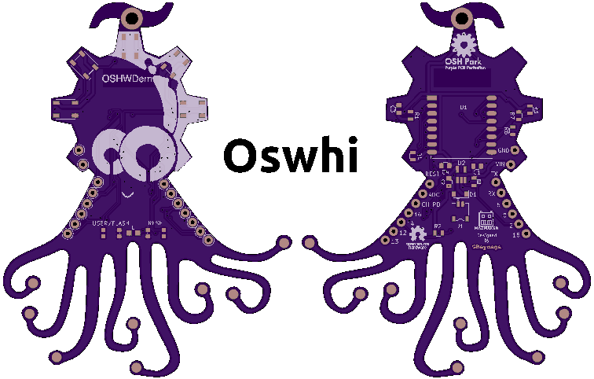

# AFOB - Another Firmware ready to run with Oshwi Board

__Oshwi board__ is the official pet at [Bricolabs OSHWDem][OSH01]. Designed by
[Gustavo Reynaga][GUS01] to the OSHWDem 2017 edition, it is a lovely badget
running with an ESP-12e module, 5 neo-pixels and a user button.

AFOB is another firmware to load in the Oshwi heart, intented to be extensible
and coded certainly to consume current as low as possible.

[GUS01]: https://twitter.com/gsreynaga
[OSH01]: http://oshwdem.org
